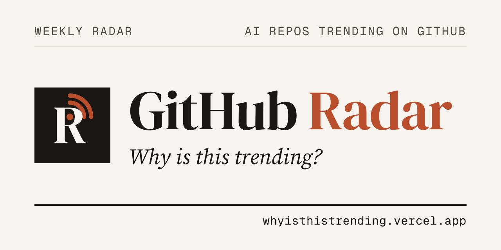
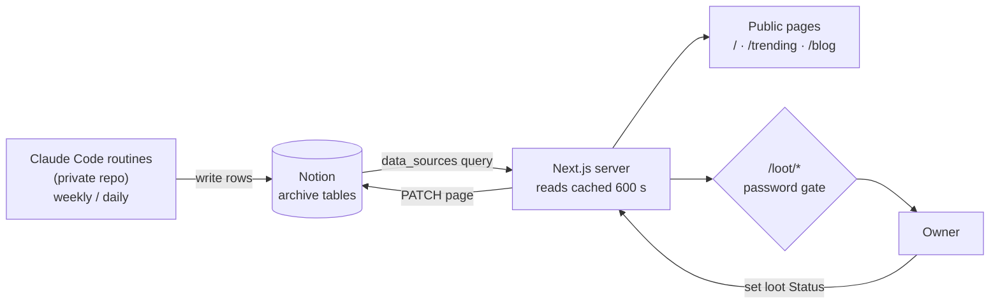

<div align="center">

# 📡 GitHub Radar

[](https://github.com/zexion7873/github-radar-ui/actions/workflows/ci.yml)



**A weekly radar of trending AI repos on GitHub, each with a one-line summary
and a sharp take.**

[](https://whyisthistrending.vercel.app)
[](NEXT16-BREAKING-CHANGES.md)
[](#%EF%B8%8F-license)

A read-mostly Next.js site over the Notion archive that a set of Claude Code
routines writes every week. The site never calls GitHub itself.

</div>

---

## 🌐 What it shows

| Page | Source table | Shows |
|---|---|---|
| `/` | Trending + Blog + Loot | **Dashboard**: the top five hot repos, the latest blog posts, and, for the signed-in owner only, one summary card per loot ledger |
| `/trending`, `/trending/[id]` | Trending Archive | Weekly trending AI repos, filterable by category, with 新上榜 / 在榜週數 badges; one page per repo |
| `/blog`, `/blog/[id]` | Blog Archive | AI and agent blog posts grouped 官方 / 個人, each with a summary and a 點評, newest first |
| `/loot/[target]`, `/loot/[target]/[id]` | Loot Ledger (`claude` / `copilot` / `opencode` / `codex`) | **Owner only.** Config assets worth stealing into each coding agent's setup, grouped by status, with an editable status |

The site is in Traditional Chinese. Every per-repo signal it shows, and the rule
that produces it, is in [`docs/signals.md`](docs/signals.md).

---

## 🔧 How it works



- **Data is written upstream.** The routines that scout GitHub and the AI blogs,
  enrich each repo and write the Notion rows live in a separate, private
  repository. This site only reads those tables.
- **One write path.** The owner can change a loot row's `Status` from the UI. It
  is a password-gated Server Action that patches that one Notion page and busts
  that ledger's cache, so a reload shows the new value.
- **Server-side only.** Every Notion call runs on the server with an internal
  integration token; the token never reaches the browser.

---

## 🔐 Access

The dashboard, `/trending` and `/blog` are public. `/loot/*` sits behind a
single-password gate, because the Vercel free tier cannot password-protect a
production deployment, so the gate lives in the app:

- [`proxy.ts`](proxy.ts) redirects any `/loot/*` request without a valid session
  to `/login`.
- A successful login sets a 30-day, HTTP-only session cookie holding an
  HMAC-signed expiry. The signing secret never leaves the server.
- The status-write Server Action checks the session again, because Server
  Actions POST to their own route and the proxy does not see them.

Signed out, the dashboard renders without the loot summary and the nav has no
Loot tab, so anonymous visitors never receive loot data.

---

## 🏃 Run it yourself

> [!NOTE]
> This is a personal dashboard. It renders tables that a private set of
> routines fills, so a fresh clone has nothing to show until you point it at
> Notion tables with the same schema. The columns each page reads are the
> `*_PROPS` maps in [`lib/data.ts`](lib/data.ts); a page whose first row lacks
> one of them shows an error naming the column rather than rendering blanks.

1. **Create a Notion integration** at <https://www.notion.so/profile/integrations>
   → New integration → Internal. Give it **Read content** and **Update content**
   (the UI writes loot status back). Copy the secret, which starts with `ntn_`.
2. **Share every table in [`lib/config.ts`](lib/config.ts)'s `TABLES` into it.**
   Open each one in Notion → `•••` → Connections → add the integration. An
   unshared table returns 404.
3. **Set three env vars.** Copy `.env.example` to `.env.local`:
   ```
   NOTION_TOKEN=ntn_xxx   # the integration secret from step 1
   APP_PASSWORD=...        # the password you type to log in
   AUTH_SECRET=...         # high-entropy key that signs the session cookie
   ```
   Generate `AUTH_SECRET` with:
   ```bash
   node -e "console.log(require('crypto').randomBytes(32).toString('hex'))"
   ```
   **All three are required.** With `AUTH_SECRET` unset the gate fails *safe*:
   every `/loot/*` route redirects to `/login` and no login can succeed. An
   unset secret must never mean "open". The public pages keep working.
4. **Run it** on the Node version in [`.nvmrc`](.nvmrc), which CI reads too:
   ```bash
   npm run dev
   ```
   Open <http://localhost:3000> and log in with `APP_PASSWORD`.

### 🚀 Deploy

Import the repository at <https://vercel.com/new>, set the same three
environment variables, and deploy. To lock the public pages down as well, turn
on Vercel Deployment Protection.

---

## 🩺 Troubleshooting

| Symptom | Check |
|---|---|
| A page shows a data error instead of its list | Read the message. "Missing expected property" names a column that page reads and its Notion table lacks: add and backfill the column in Notion first, because the reader cannot invent it. |
| A Notion edit doesn't show up | Reads are cached for 600 seconds. On `npm run dev`, delete the whole `.next` directory, not just restart, before concluding the change failed. |
| One tab's data error says the table could not be found | That table is not shared with the integration (step 2). |
| `/loot` keeps bouncing to `/login` | `AUTH_SECRET` or `APP_PASSWORD` is unset in this environment. The server log says which; the login page deliberately does not. |

---

## 🛠️ Develop

```bash
npm run lint && npm run build && npm test
```

CI runs exactly these three on every push and pull request, and needs no
environment variables: every route renders on demand, so the build never reads
Notion. [CONTRIBUTING.md](CONTRIBUTING.md) has the traps worth knowing first;
[AGENTS.md](AGENTS.md) and [NEXT16-BREAKING-CHANGES.md](NEXT16-BREAKING-CHANGES.md)
have the rest.

---

## ⚖️ License

All rights reserved. The source is public to read; no license is granted to
copy, modify or redistribute it.

Unofficial personal project. Not affiliated with, endorsed by, or sponsored by
GitHub, Notion, Vercel or Anthropic.
