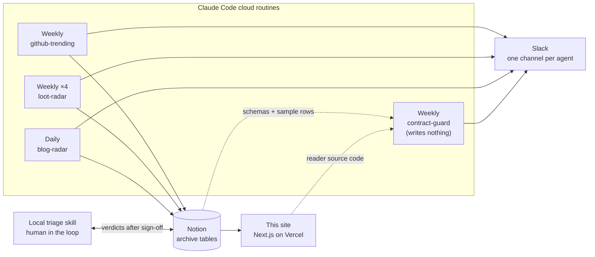

# Case study: the agent pipeline behind GitHub Radar

This site is the visible end of a larger system. Behind it, seven scheduled
Claude Code agents scout GitHub and the AI blogs, enrich what they find, write
it to Notion, and post a digest to Slack. That code lives in a private
repository (`ai-assistant`); this document describes how it is built, what went
wrong in production, and what each failure changed.

**At a glance**

- **7 scheduled agent runs**, daily and weekly, on Claude Code cloud routines.
  Nothing runs on my laptop.
- **4 skills**, about 1,300 lines of versioned `SKILL.md` instructions, plus a
  local triage skill that keeps a human in the loop.
- **6 Notion tables** as the shared archive, all read by this site and checked
  every week by an agent that writes nothing.
- **One hard rule:** every agent's write surface is bounded and spelled out,
  because the cloud runtime approves connector writes without asking anyone.

---

## The system

| Agent | Cadence | Reads | Writes |
|---|---|---|---|
| **github-trending** | weekly | GitHub Trending, topic search, ecosyste.ms, the GitHub API | one row per repo: stars/week, live total, category, maintenance, license, a one-line take |
| **loot-radar** ×4 | weekly | GitHub, plus a clone of the target tool's real config | a shortlist of config assets worth stealing into Claude Code, Copilot, opencode or Codex, each to its own table |
| **blog-radar** | daily, silent when nothing is new | a watch list of AI-lab and practitioner blogs | one row per new post, with a full summary |
| **contract-guard** | weekly | every table's schema, a row sample, and this site's source | nothing; a PASS / FINDINGS / INCONCLUSIVE verdict to Slack |

Each agent is a `SKILL.md` file committed to git. A cloud routine clones the
repository, loads the skill, and runs it unattended. The trigger's own prompt
carries only parameters: which tool to target, which Slack channel, which Notion
table. The four loot agents are one skill run with four parameter sets, not four
copies.

The Trending Archive has a second reader:
[radar-rag](https://github.com/zexion7873/radar-rag), a Java / Spring AI service
that answers questions over it with citations. contract-guard covers it without
reading its code: the eight columns it reads are a subset of the ones this site
reads, so any finding on those columns names radar-rag as affected too. That
matters because radar-rag fails silently where this site shows an error.

---

## Design decisions

**Enrichment happens at write time; the site only reads.** Every per-repo
signal (stars per week, a live star total, maintenance, risk, license) is
computed by the agent that writes the row. The site never calls GitHub or
ecosyste.ms. The alternative was a read-time enrichment layer in the site; it
lost because it would have put rate limits, retries and API keys behind every
page view, while the agents already had the data in hand.

**Bounded writes are the safety model.** A cloud routine approves connector
writes without asking, and its sandbox does not stop them, so the skill file is
the only safety net. Each one names its write surface exactly: an archive agent
may create or update rows in its one table and never deletes, and
contract-guard may not write at all. "Never deletes" is enforced by banning,
by name, the calls that can delete by side effect (moving a page to the trash,
replacing a page's content), because the connector has no tool literally named
delete.

**The contract is checked against live source, not a manifest.** If a column
the site reads goes missing from a table, the page shows an error instead of its
list, for every visitor. contract-guard catches that before a visitor does: each week
it greps the column names the reader expects straight out of this repository's
source, compares them with every table's live schema, and posts a verdict every
run, clean or not. A written manifest of expected columns was the obvious
alternative; it lost because a manifest drifts away from the code it describes,
which is the exact failure the guard exists to catch. The guard reports and
never repairs, because only a human knows whether the writer or the reader is
the wrong side.

**State changes wait for a human.** The loot agents only propose. A local
triage skill checks each proposal against my actual setup, and nothing is
written until I sign off on the verdict table. A row marked `adopted` means the
thing is installed, not that I meant to install it; an adopt I have not wired
yet is parked with its install command.

---

## What broke, and what it changed

**The live prompts drifted away from the skills.** A routine has two
instruction sources: the committed skill, and the trigger's prompt, which lives
in the cloud and is invisible to git. On 2026-09-08 five of the writing routines
turned out to restate a rule that the skills had since banned: finding an
existing row by fuzzy search. A fuzzy miss reads as "no prior row", which means
a duplicate row and a returning repo labelled new. Two prompts had also dropped
the guard that protects a human's triage, so a same-week re-run would have
reset my rulings back to `new`. Git showed a clean history the whole time.
**Changed:** a trigger prompt now carries only what the skill cannot know
(target, channel, table), and says "follow the skill's step N" for everything
else. All five were rewritten and re-read from the live API.

**Two agents silently read half the data.** The loot agents read the trending
table through a saved view, which is sorted by stars per week and paginated. A
2026-09-29 audit of five run logs found that two of the four stopped after the
first page, even though their own output printed `has_more: True`. The lowest
nine rows of the two latest weeks, seven repos, never reached them.
**Changed:** the last page must now print how many pages were read and the
full candidate pool, so stopping early shows up in the run log.

**A shared quota nobody owned.** The Notion workspace allows only about eight
SQL queries a day, shared by every routine that fires that day, and a rejected
query still spends one. Adding SQL reads for a new feature would have starved
the dedup read of whichever routine ran last on a Friday.
**Changed:** bulk reads go through saved views, which the quota does not count.
The 2026-09-29 audit confirmed each loot routine spent exactly one SQL call, on
its own dedup.

**The star totals were weeks old.** The archive's star total came from
ecosyste.ms, which lagged GitHub by a median of 5 days and up to 41. Ten rows
showed more stars gained in a week than the repo had in total.
**Changed:** the total is now fetched live from the GitHub API, and a total
smaller than the week's gain is written blank rather than wrong. The history
before that switch is marked as not comparable.

**A secret mask that disabled itself.** The triage skill reads one config file
through an `awk` mask that hides credential values. Invoking the skill with an
argument made the skill loader substitute `$0` in its body, which turned the
mask's `$0` into a literal word: the mask stopped hiding anything while the
safety banner it printed stayed. **Changed:** written as `$(0)`, which means the
same to `awk` and is not substituted. Any skill with `$0` in a shell block is
exposed to the same thing.

---

## How I check that it works

- **A run log is the evidence, not the Slack post.** The digest says what the
  agent chose to report; the log says what it actually did. Every audit above
  came from reading run logs end to end.
- **Verification is adversarial.** contract-guard's first PASS was re-derived by
  an independent run that rebuilt the reader contract from source, re-fetched
  every schema, and tried to refute each candidate finding. Of 16 candidates, 1
  survived; the other 15 were cases the guard's own exception list already
  covered.
- **The triage filter is strict on purpose.** One full pass over the Claude Code
  queue on 2026-10-04 ruled 24 candidates: 0 adopt, 5 trial, 2 already
  installed, 17 skip. A radar that recommends most of what it finds is not
  filtering anything.

## What the archive showed

The archive is useful beyond the digests. Sixteen weeks of trending data (190
rows, 111 repos, June to September 2026) showed that what goes viral among AI
repos shifted from software to markdown: skill and prompt packs, lists and books
went from 24% of weekly stars in June to 60% in September.

## Open items

- **Fake-star detection is deferred, not dropped.** Per-stargazer analysis does
  not fit an agent's request budget, and a velocity-only flag would fire on
  every legitimate viral launch in this exact niche.
- **Two guard paths have never fired on a real case.** They pass, but a check
  that has never caught anything is not yet proof that it would.

---

**Stack:** Claude Code cloud routines and skills · Notion API and MCP · Slack ·
GitHub and ecosyste.ms APIs · Next.js 16 on Vercel.
